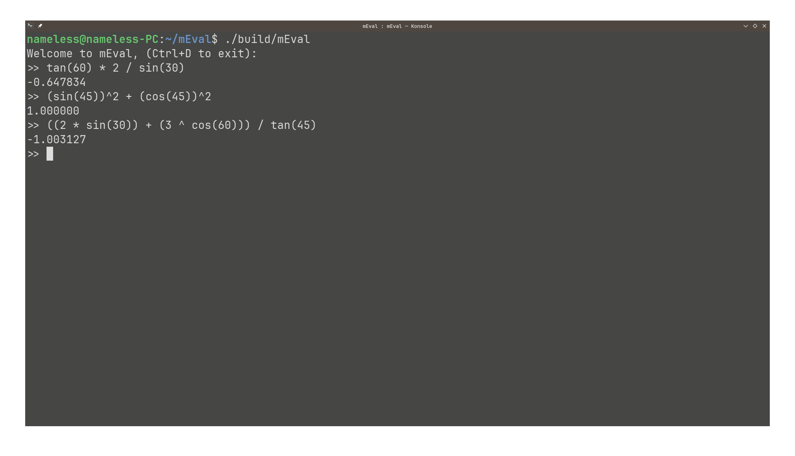

# mEval: Mathematical Evaluator
<br>

<p align="center">
  
</p>

## About
A mathematical expression interpreter in C that uses recursive descent parsing to generate an Abstract Syntax Tree (AST). The AST is generated from a stream of tokens produced by a lexer.

For more details, check out: [parser grammar](resources/parser_grammar.pdf).

---
## Features
- Arithmetic operations: $\large +,-, \times, \div, \hat{\mkern6mu}$
- Trigonometric functions: $\large \text{sin, cos, tan}$
- Operator precedence and expression grouping.

_*The parser supports negative exponents but only if placed in brackets. This is not required for positive exponents._
## Installation

- Requires **libbsd**
- Requires **make**
- Requires **gcc**

### Ubuntu/Debian
```
sudo apt-get install build-essential libbsd-dev
```
### Fedora
```
sudo dnf install @development-tools libbsd-devel
```

### Arch
```
sudo pacman -S base-devel libbsd
```
## Build
Clone the repository:
   ```bash
   git clone https://github.com/Nameless-Dev0/mEval.git
   cd mEval
```
Build project with make:
```
make
```
Run the interpreter:
```
./build/mEval
```
## Testing 
Build & run tests:
```
make tests
./build_tests/test_runner
```
_**TODO**: - Add parser tests_

## Usage
Run the interpreter: Simply compile and run the program. It will prompt you for input.
<p align="center">
  
</p>
Exit: To exit the interpreter: use Ctrl+D


## License
This project is licensed under the MIT License - see the [LICENSE](LICENSE) file for details.

### Resources I found helpful:
- https://www.savarese.org/articles/1998-2006/2001-05-Recursive_Descent_Parsing/index.pdf
- https://www.youtube.com/playlist?list=PLmG_3qmc10qQKLgP2H_d2BHHzD3RQWBE_